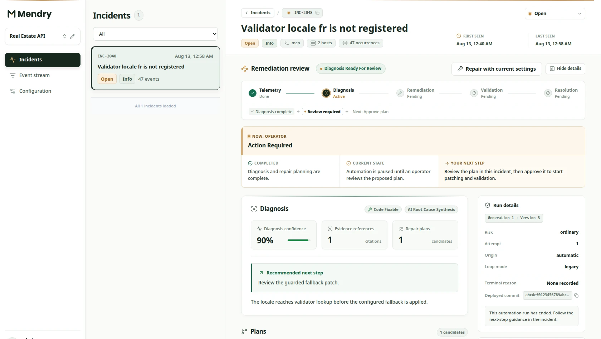
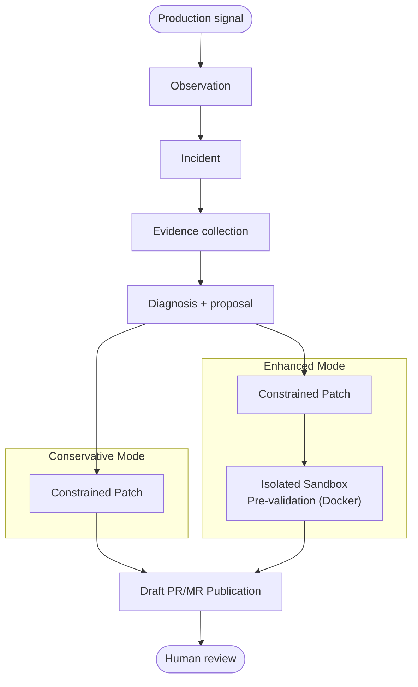

<p align="center">
  <picture>
    <source media="(prefers-color-scheme: dark)" srcset="./logo/mendry-logo-horizontal-reversed.svg" />
    
  </picture>
</p>

<p align="center">
  <strong>Trace the signal. Ground the diagnosis. Keep action under control.</strong>
</p>

<p align="center">
  A self-hosted AI incident investigation system built on bounded, inspectable
  agent execution.
</p>

<p align="center">
  <a href="https://www.mendry.net/docs/">Documentation</a> &middot;
  <a href="https://www.mendry.net/docs/get-started/">Get started</a> &middot;
  <a href="https://www.mendry.net/docs/guides/operator-workflow/">Operator workflow</a> &middot;
  <a href="https://www.mendry.net/docs/guides/automatic-hotfix/">Automatic hotfix</a> &middot;
  <a href="https://www.mendry.net/docs/reference/features/">Feature map</a> &middot;
  <a href="https://www.mendry.net/zh-cn/docs/">Chinese docs</a>
</p>

---

Mendry connects production signals, operational evidence, and deployed code to
produce a reviewable diagnosis and repair proposal. Its Agent Harness constrains
model and tool execution with explicit policy, finite budgets, durable state,
and artifact provenance. People retain control of merge, deployment, rollback,
and recovery decisions.

<p align="center">
  
</p>

<p align="center"><sub>Incident detail in the Mendry console, rendered with synthetic project and incident data.</sub></p>

## Why Mendry

|                                 |                                                                                               |
| ------------------------------- | --------------------------------------------------------------------------------------------- |
| **Evidence before conclusions** | Correlate alerts, logs, code, and immutable deployment context before proposing a cause.      |
| **Bounded execution**           | Restrict tools and effects with trusted policy, explicit schemas, and independent budgets.    |
| **Inspectable by default**      | Preserve ordered model/tool history, invocation outcomes, artifacts, and completion reasons.  |
| **Human-controlled action**     | Deliver evidence-backed patches as Draft PRs/MRs for review without silent merge or deploy.  |

## How it works



The current incident application accepts project-scoped observations and signed
webhooks, groups signals into incidents, tracks incident lifecycle, collects trusted
evidence, and coordinates repair proposals.

Remediation can run in **Conservative mode** (creating a constrained patch and
publishing a Draft PR/MR to GitHub or GitLab for repository CI and human review)
or **Enhanced mode** (with optional containerized pre-validation against
approved Go or Node builder toolchains in a network-isolated Docker sandbox).
All runs are backed by durable checkpoints and an execution recovery worker.

Underneath it, the neutral Agent Harness owns the reusable execution contract:

- trusted composition selects the profile, provider, tools, policy, and completion evaluator;
- event data supplies bounded goals and context, never credentials or authority;
- tool intent is persisted before an external effect is attempted;
- unknown write outcomes stop for resolution instead of being replayed blindly;
- artifacts distinguish model-authored, observed, and independently verified claims.

Read [Operator workflow](https://www.mendry.net/docs/guides/operator-workflow/),
[Automatic hotfix](https://www.mendry.net/docs/guides/automatic-hotfix/), and
[Agent Harness concepts](https://www.mendry.net/docs/concepts/agent-harness/)
for the complete execution and extension boundaries.

## Project status

Mendry is under active development. Status labels describe verified evidence,
not product ambition.

| Area                                    | Status      | Current boundary                                                                                |
| --------------------------------------- | ----------- | ----------------------------------------------------------------------------------------------- |
| Shared Agent Harness foundation         | **Preview** | Neutral execution contracts and core mechanics are implemented and focused-tested.              |
| Existing incident application           | **Preview** | Single-user workflow with projects, sessions, webhooks, evidence, and remediation review.       |
| Account-free Local composition          | **Preview** | Source CLI supports run, inspect, resume, and operator resolution with durable snapshots.       |
| Automatic hotfix & local pre-validation | **Preview** | Bounded patch generation, container test verification, and draft PR/MR creation on SCMs.        |
| Generic run service and UI              | **Planned** | Generic event, run, call, and artifact product surfaces are not yet available.                  |
| Production distribution                 | **Planned** | No supported image, Compose bundle, upgrade path, or rollback package is published.             |

See the [detailed capability matrix](https://www.mendry.net/docs/project/status/)
before evaluating an integration. PostgreSQL, Redis, one login identity, and
projects are requirements of the existing incident application, not of the
neutral Harness core.

## Source evaluation

> [!IMPORTANT]
> The repository does not yet ship a supported production installation bundle.
> Use a private evaluation environment and do not commit `.env`, credentials,
> tokens, or encryption keys.

### Prerequisites

- Go 1.25
- Node.js 22.19.0 and npm
- PostgreSQL
- Redis
- OpenSSL, or another secure generator for a 32-byte encryption key
- Docker (optional, required only for Enhanced local pre-validation mode)

### Start the API

From `backend/`, create a private environment file and set
`MENDRY_POSTGRES_URL` and `MENDRY_REDIS_URL`. Keep the encryption key stable for
the lifetime of the database.

```bash
cd backend
cp .env.example .env
export MENDRY_ENCRYPTION_KEY="$(openssl rand -base64 32)"

make run-migrate
MENDRY_BOOTSTRAP_ADMIN_PASSWORD='replace-with-a-long-random-password' \
  make bootstrap-admin USERNAME=admin
make run-api
```

The API listens on `http://127.0.0.1:8080` by default. Check process and
dependency readiness with:

```bash
curl http://127.0.0.1:8080/livez
curl http://127.0.0.1:8080/readyz
```

### Start the console

In another terminal:

```bash
cd frontend
npm ci
npm run dev
```

The Vite development server proxies `/api` to `127.0.0.1:8080`. Continue with
the [source-evaluation guide](https://www.mendry.net/docs/get-started/bootstrap/)
to create a project and configure an incident signal.

## Repository

```text
backend/   Go API, incident modules, and the shared Agent Harness
frontend/  React and TypeScript operator console
docs/      Bilingual Astro and Starlight documentation site
logo/      Mendry brand assets and usage guidance
```

The repository contains independently buildable packages rather than a single
root workspace.

| Package                    | Stack                        | Main verification                                                               |
| -------------------------- | ---------------------------- | ------------------------------------------------------------------------------- |
| [`backend/`](./backend/)   | Go 1.25, PostgreSQL, Redis   | `cd backend && make check`                                                      |
| [`frontend/`](./frontend/) | React 19, TypeScript, Vite   | `cd frontend && npm run lint && npm run typecheck && npm test && npm run build` |
| [`docs/`](./docs/)         | Astro, Starlight, Playwright | `cd docs && npm ci && npm run verify`                                           |

For backend composition, configuration, API routes, local Harness internals,
and focused test commands, use the [backend guide](./backend/README.md). For the
documentation release contract and Cloudflare Pages settings, use the
[documentation guide](./docs/README.md).
