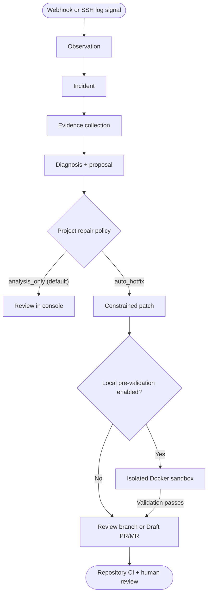

<p align="center">
  <picture>
    <source media="(prefers-color-scheme: dark)" srcset="./logo/mendry-logo-horizontal-reversed.svg" />
    
  </picture>
</p>

<p align="center">
  <strong>Trace the signal. Ground the diagnosis. Keep action under control.</strong>
</p>

<p align="center">
  A self-hosted AI incident investigation system built on bounded, inspectable
  agent execution.
</p>

<p align="center">
  <a href="https://www.mendry.net/docs/">Documentation</a> &middot;
  <a href="https://www.mendry.net/docs/get-started/">Get started</a> &middot;
  <a href="https://www.mendry.net/docs/guides/operator-workflow/">Operator workflow</a> &middot;
  <a href="https://www.mendry.net/docs/guides/automatic-hotfix/">Automatic hotfix</a> &middot;
  <a href="https://www.mendry.net/docs/reference/features/">Feature map</a> &middot;
  <a href="https://www.mendry.net/zh-cn/docs/">Chinese docs</a>
</p>

---

Mendry connects production signals, operational evidence, and deployed code to
produce a reviewable diagnosis and repair proposal. Its Agent Harness constrains
model and tool execution with explicit policy, finite budgets, durable state,
and artifact provenance. People retain control of merge, deployment, rollback,
and recovery decisions.

<p align="center">
  
</p>

<p align="center"><sub>Incident detail in the Mendry console, rendered with synthetic project and incident data.</sub></p>

## Why Mendry

|                                 |                                                                                              |
| ------------------------------- | -------------------------------------------------------------------------------------------- |
| **Evidence before conclusions** | Correlate alerts, logs, code, and immutable deployment context before proposing a cause.     |
| **Bounded execution**           | Restrict tools and effects with trusted policy, explicit schemas, and independent budgets.   |
| **Inspectable by default**      | Preserve ordered model/tool history, invocation outcomes, artifacts, and completion reasons. |
| **Human-controlled action**     | Deliver evidence-backed patches as Draft PRs/MRs for review without silent merge or deploy.  |

## Integrations and operator features

| Capability            | Current behavior                                                                                                                               | Guide                                                                                                                                   |
| --------------------- | ---------------------------------------------------------------------------------------------------------------------------------------------- | --------------------------------------------------------------------------------------------------------------------------------------- |
| SSH log monitoring    | Install a managed probe over SSH, browse remote files, and trigger incidents with manual or AI-generated rules for one regular Linux log file. | [SSH log monitoring](https://www.mendry.net/docs/guides/managed-log-probe/)                                                             |
| Incoming alerts       | Receive generic webhooks, Tencent CLS callbacks, or AWS CloudWatch alarms through SNS. AWS-origin incidents remain analysis-only.              | [Signed webhooks](https://www.mendry.net/docs/guides/signed-webhooks/) · [Tencent CLS](https://www.mendry.net/docs/guides/tencent-cls/) |
| Investigation         | Review the event stream, incident evidence, diagnosis, proposed changes, and execution outcomes.                                               | [Operator workflow](https://www.mendry.net/docs/guides/operator-workflow/)                                                              |
| Automatic hotfix      | Optionally prepare bounded changes, run local pre-validation, and publish a review branch or Draft PR/MR under project policy.                 | [Automatic hotfix](https://www.mendry.net/docs/guides/automatic-hotfix/)                                                                |
| Project notifications | Send incident triggers and first AI results to Telegram, Feishu, or WeCom; inspect delivery history and retry eligible failures.               | [Notifications](https://www.mendry.net/docs/guides/notifications/)                                                                      |
| Model providers       | Configure an OpenAI-compatible provider, choose a model, and test the connection per project.                                                  | [LLM providers](https://www.mendry.net/docs/guides/llm-providers/)                                                                      |

## How it works



The current incident application accepts project-scoped observations, signed
webhooks, and managed SSH log events, groups signals into incidents, tracks
incident lifecycle, collects trusted evidence, and coordinates repair proposals.

The default **analysis-only** policy produces a diagnosis and proposed changes
for review in the console. It does not publish a branch or pull request.
Opting into **automatic hotfix** allows constrained patch generation and review
branch or Draft PR/MR publication, depending on the repository provider.
**Enhanced mode** adds containerized pre-validation against approved Go or
Node builder toolchains in a network-isolated Docker sandbox. Publishing requires
configured write credentials and project policy; it does not merge, deploy,
roll back, or confirm recovery. Remediation execution uses durable checkpoints
and an execution recovery worker.

Underneath it, the neutral Agent Harness defines the reusable execution contract.
The incident coordinator currently shares model/history mechanics with the Harness;
the full incident Runner migration remains planned.

The shared contracts provide these boundaries:

- trusted composition selects the profile, provider, tools, policy, and completion evaluator;
- event data supplies bounded goals and context, never credentials or authority;
- tool intent is persisted before an external effect is attempted;
- unknown write outcomes stop for resolution instead of being replayed blindly;
- artifacts distinguish model-authored, observed, and independently verified claims.

Read [Operator workflow](https://www.mendry.net/docs/guides/operator-workflow/),
[Automatic hotfix](https://www.mendry.net/docs/guides/automatic-hotfix/), and
[Agent Harness concepts](https://www.mendry.net/docs/concepts/agent-harness/)
for the complete execution and extension boundaries.

## Project status

Mendry is under active development. Status labels describe verified evidence,
not product ambition.

| Area                                    | Status      | Current boundary                                                                          |
| --------------------------------------- | ----------- | ----------------------------------------------------------------------------------------- |
| Shared Agent Harness foundation         | **Preview** | Neutral execution contracts and core mechanics are implemented and focused-tested.        |
| Existing incident application           | **Preview** | Single-user workflow with projects, sessions, webhooks, evidence, and remediation review. |
| Account-free Local composition          | **Preview** | Source CLI supports run, inspect, resume, and operator resolution with durable snapshots. |
| Automatic hotfix & local pre-validation | **Preview** | Bounded patch generation, container test verification, and draft PR/MR creation on SCMs.  |
| Generic run service and UI              | **Planned** | Generic event, run, call, and artifact product surfaces are not yet available.            |
| Production distribution                 | **Planned** | No supported image, Compose bundle, upgrade path, or rollback package is published.       |

See the [detailed capability matrix](https://www.mendry.net/docs/project/status/)
before evaluating an integration. PostgreSQL, Redis, one login identity, and
projects are requirements of the existing incident application, not of the
neutral Harness core.

## Source evaluation

> [!IMPORTANT]
> The repository does not yet ship a supported production installation bundle.
> Use a private evaluation environment and do not commit `.env`, credentials,
> tokens, or encryption keys.

### Choose an evaluation path

- **Incident console:** follow the API and console steps below. This path requires PostgreSQL, Redis, and the single login identity.
- **Local Agent Harness:** follow the [account-free source walkthrough](https://www.mendry.net/docs/get-started/local-harness/). Its offline fixture needs Go and Make, without the API, databases, login, or model credentials.

### Incident application prerequisites

- Git and Make
- Go 1.25 or newer (see [`backend/go.mod`](./backend/go.mod))
- Node.js 22.19.0 (the pinned version) and npm 9.6.5 or newer
- A running PostgreSQL instance with a database and credentials, and a running Redis instance
- OpenSSL, or another secure generator for a 32-byte encryption key
- Docker (optional, required for Enhanced local pre-validation)

Live investigation also needs a configured model provider, a readable Git
baseline, and the selected evidence source. SSH log probes require a Linux
host with Python 3.6+, systemd, non-interactive `sudo -n`, and outbound HTTPS
access to Mendry. See the integration guides for source-specific requirements.

### Start the API

From the repository root, create a private environment file on first setup:

```bash
cd backend
cp .env.example .env
openssl rand -base64 32
```

Edit `backend/.env`: set `MENDRY_POSTGRES_URL` and `MENDRY_REDIS_URL` for your
running services, and replace the example `MENDRY_ENCRYPTION_KEY` with the
generated value. Save that key once and reuse it for every restart against the
same database; regenerating it makes existing encrypted credentials unreadable.
The backend loads `.env` when started from `backend/`; exported shell values
take precedence.

Then, from `backend/`, apply migrations, create the login identity, and start
the API:

```bash
make run-migrate
MENDRY_BOOTSTRAP_ADMIN_PASSWORD='replace-with-a-long-random-password' \
  make bootstrap-admin USERNAME=admin
make run-api
```

The bootstrap password must be 12–72 bytes. On later starts, reuse the saved
configuration and run `make run-api`; apply pending migrations before starting
an updated backend. The API does not apply migrations automatically.

The API listens on `http://127.0.0.1:8080` by default. Check process and
dependency readiness with:

```bash
curl http://127.0.0.1:8080/livez
curl http://127.0.0.1:8080/readyz
```

### Start the console

In another terminal, from the repository root:

```bash
cd frontend
npm ci
npm run dev
```

Open the local URL printed by Vite (normally `http://localhost:5173`) and sign
in with the bootstrapped credentials. The development server proxies `/api` to
`127.0.0.1:8080`.

### Configure your first project

1. [Create a project](https://www.mendry.net/docs/get-started/first-project/) and save its environment, Git baseline, and collection source. Configuration steps save independently.
2. Choose [SSH log monitoring](https://www.mendry.net/docs/guides/managed-log-probe/) for a Linux log file, or a [webhook integration](https://www.mendry.net/docs/guides/signed-webhooks/) for an existing alerting platform.
3. Configure the [model provider](https://www.mendry.net/docs/guides/llm-providers/) for investigation and keep the default analysis-only policy while evaluating evidence and results.
4. Verify a new signal in the event stream and [inspect the resulting incident](https://www.mendry.net/docs/get-started/first-incident/). Optionally configure [notifications](https://www.mendry.net/docs/guides/notifications/).

For external senders or a remote SSH probe, set `MENDRY_PUBLIC_URL` to a
reachable API base URL; a remote host cannot use the default loopback address
to reach your local API. The console's development proxy only covers `/api`,
so `/hooks` must reach the backend separately. SSH probe delivery requires HTTPS.
Use [troubleshooting](https://www.mendry.net/docs/guides/troubleshooting/) for
startup, ingestion, probe, and notification failures.

## Repository

```text
backend/   Go API, incident modules, and the shared Agent Harness
frontend/  React and TypeScript operator console
docs/      Bilingual Astro and Starlight documentation site
logo/      Mendry brand assets and usage guidance
```

The repository contains independently buildable packages rather than a single
root workspace.

| Package                    | Stack                        | Main verification                                                                         |
| -------------------------- | ---------------------------- | ----------------------------------------------------------------------------------------- |
| [`backend/`](./backend/)   | Go 1.25, PostgreSQL, Redis   | `cd backend && make check`                                                                |
| [`frontend/`](./frontend/) | React 19, TypeScript, Vite   | `cd frontend && npm ci && npm run lint && npm run typecheck && npm test && npm run build` |
| [`docs/`](./docs/)         | Astro, Starlight, Playwright | `cd docs && npm ci && npm run verify`                                                     |

Install the Playwright Chromium browser before the first documentation verification
(`cd docs && npx playwright install chromium`, after `npm ci`). On Linux, missing
browser system libraries can be installed with `npx playwright install --with-deps chromium`.
The documentation gate also performs an npm dependency audit and requires network access.

For backend composition, configuration, API routes, local Harness internals,
and focused test commands, use the [backend guide](./backend/README.md). For the
documentation release contract and Cloudflare Pages settings, use the
[documentation guide](./docs/README.md).
